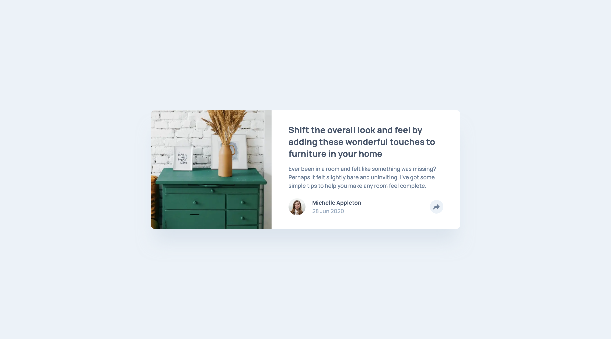
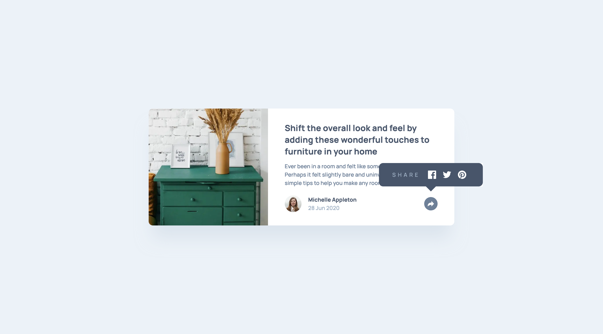
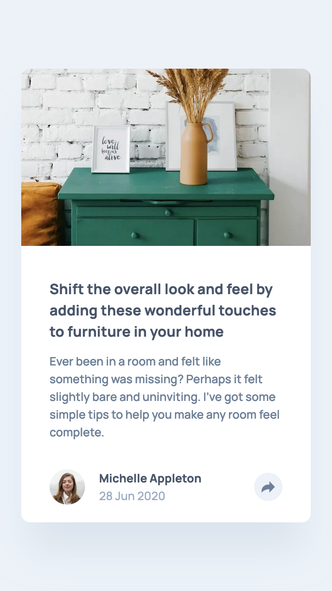
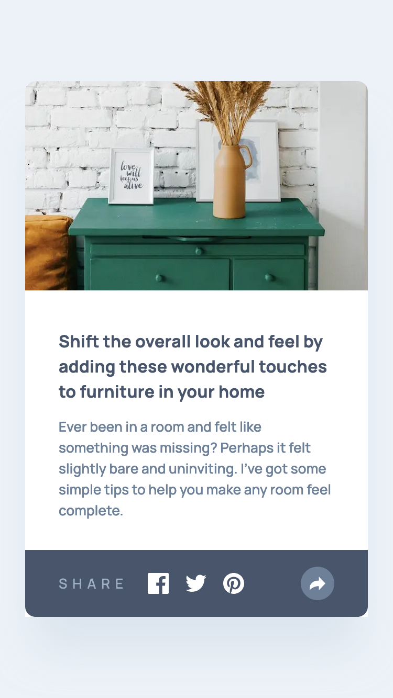

# Frontend Mentor - Article preview component solution

This is a solution to the [Article preview component challenge on Frontend Mentor](https://www.frontendmentor.io/challenges/article-preview-component-dYBN_pYFT). Frontend Mentor challenges help you improve your coding skills by building realistic projects.

## Table of contents

- [Overview](#overview)
  - [The challenge](#the-challenge)
  - [Screenshot](#screenshot)
  - [Links](#links)
- [Getting Started](#getting-started)
  - [Prerequisites](#prerequisites)
  - [Installation](#installation)
- [My process](#my-process)
  - [Built with](#built-with)
  - [What I learned](#what-i-learned)
  - [Continued development](#continued-development)
  - [Useful resources](#useful-resources)
- [Author](#author)

## Overview

### The challenge

Users should be able to:

- See the social media share links when they click the share icon
- View the optimal layout for each page depending on their device's screen size
- See hover states for all interactive elements on the page

### Screenshot

<div style='display: flex; gap: 10px;'>




</div>

### Links

- Solution URL: https://www.frontendmentor.io/solutions/article-preview-component-with-nextjs-tailwind-css-VXN_rFqfbc
- Live Site URL: https://article-preview-component-sigma-ten.vercel.app

## Getting Started

To get a local copy up and running follow these simple steps:

### Prerequisites

Make sure you have the following software installed on your machine:

- [Node.js](https://nodejs.org/) (Node.js 18.17 or later)
- [pnpm](https://pnpm.io/)

### Installation

1. Clone the repository:

   ```sh
   git clone https://github.com/jaceleedev/article-preview-component.git
   ```

2. Navigate to the project directory:

   ```sh
   cd article-preview-component
   ```

3. Install dependencies using pnpm:

   ```sh
   pnpm install
   ```

4. Start the development server:

   ```sh
   pnpm dev
   ```

5. Open your browser and visit http://localhost:3000 to view the project.

## My process

### Built with

- Next.js (v14.2.5)
- TypeScript (v5)
- Tailwind CSS (v3.4.1)
- Semantic HTML5 markup
- CSS Grid, Flexbox
- SEO & web accessibility

### What I learned

Throughout this project, I gained valuable insights and improved my skills in several areas:

1. From this project onwards, logic requiring the use of state was introduced, and it was exciting to create the ShareBar functionality by appropriately utilizing useState. I was particularly pleased with how smoothly I implemented the ShareBar, which had slightly different appearances in mobile and desktop views.

2. I learned for the first time during this project that the tag is used to implement modal dialog boxes (pop-up windows). It's much better than using both functionally and in terms of accessibility. I think I'll use it often when creating modals in the future.

These learnings have not only improved my technical skills but also given me a clearer direction for future growth and areas to focus on in upcoming projects.

### Continued development

In future projects, I want to continue focusing on and improving in these areas:

I will be taking on increasingly complex projects, and I want to write better code by considering system design from a front-end perspective. This is not a short-term task. Regardless of the project I undertake, the more I think about it, the more it will help me grow.

By focusing on these areas, I hope to continually improve my front-end development skills and create more efficient and sophisticated web applications.

### Useful resources

- [Next.js Documentation](https://nextjs.org/docs) - Comprehensive guide to Next.js features and API.
- [Tailwind CSS Documentation](https://tailwindcss.com/docs/installation) - Detailed documentation for Tailwind CSS.

## Author

- GitHub - [@jaceleedev](https://github.com/jaceleedev)
- Frontend Mentor - [@jaceleedev](https://www.frontendmentor.io/profile/jaceleedev)
